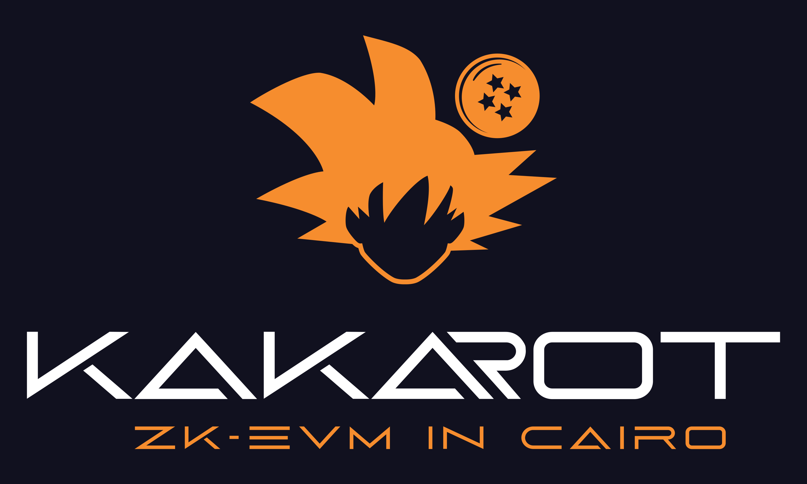

<p align="center">
    
</p>
<div align="center">
  <h1 align="center">Kakarot</h1>
  <h3 align="center">Landing page of Kakarot - An EVM interpreter written in Cairo.</h3>
</div>

## Development

Run the development server:

```bash
npm run dev
# or
yarn dev
```

Open [http://localhost:3000](http://localhost:3000)
